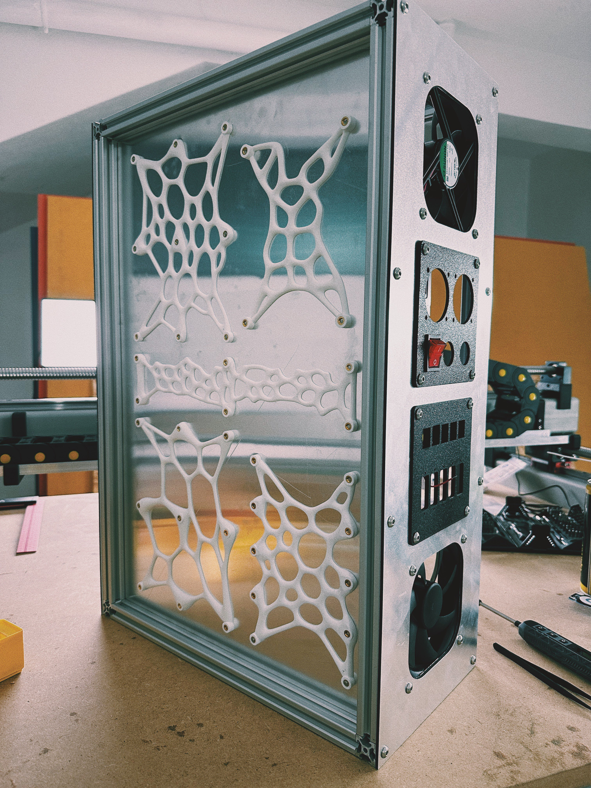

# Bolt holders for Electronics mounting

These mount on the back of the mounting panel in the Electronics Enclosure when using ACM/Dibond panels, so that M4 and M5 bolts have something to screw into on the reverse using heatset inserts.

- VFD mount - 4x M5 heatset inserts
- Stepper driver mount - 10x M4 heatset inserts
- DIN Rail & wire ducts - 9x M4 heatset inserts each (x2)
- Center wire duct mount - 6x M4 heatset inserts

The parametric Grasshopper file can be used to generate different spacings or patterns.