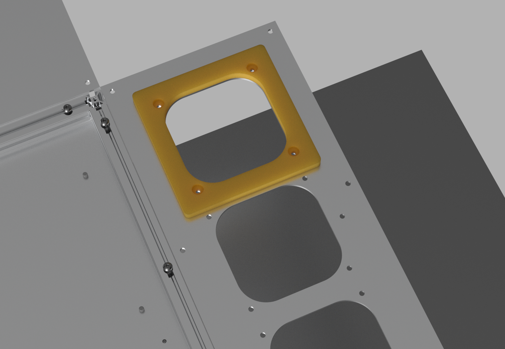

# Templates for Electronics Assembly

Templates to help with assembly of the printNC Electronics Enclosure

PDF templates to mark out screw holes for drilling. These are 1:1 scale, printable on A3 paper, which can be stuck onto the panels:

- Mounting panel
- Left side panel
- Right side panel

3D printable router templates to cut out panel holes:

- Left panel cutouts (fans, cable entry)
- Right panel cutout for switch panel

