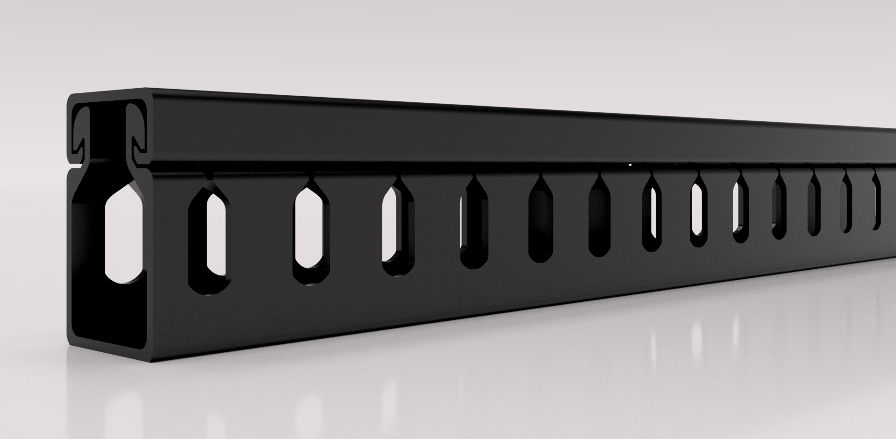
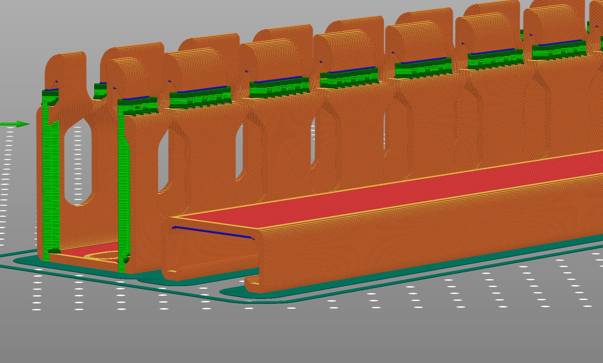

# Parametric Wire Ducts

Printable wire ducts for use with [LoganFraser's PrintNC Electronics Enclosure](https://github.com/LoganFraser/PrintNCMods/tree/main/Electronics_Enclosure/). It would probably be easier to buy these off the shelf, but in the event that's difficult then these should suffice.

The design uses two lengths — 240mm and 320mm, which are both available in the STLs folder.

The CAD file is fully parametric, and can be customised with length/width/height, and slot and screw sizes and spacings.

The design is optimised for printability with minimal supports:

- the top parts have a flat lip on either side and can be printed in the existing orientation (not with the top on the build plate) with the top bridging without supports.
- the base parts should have supports enabled to support the hook, but these can rest on the flat towards the top, and not from the build plate, as shown below:

